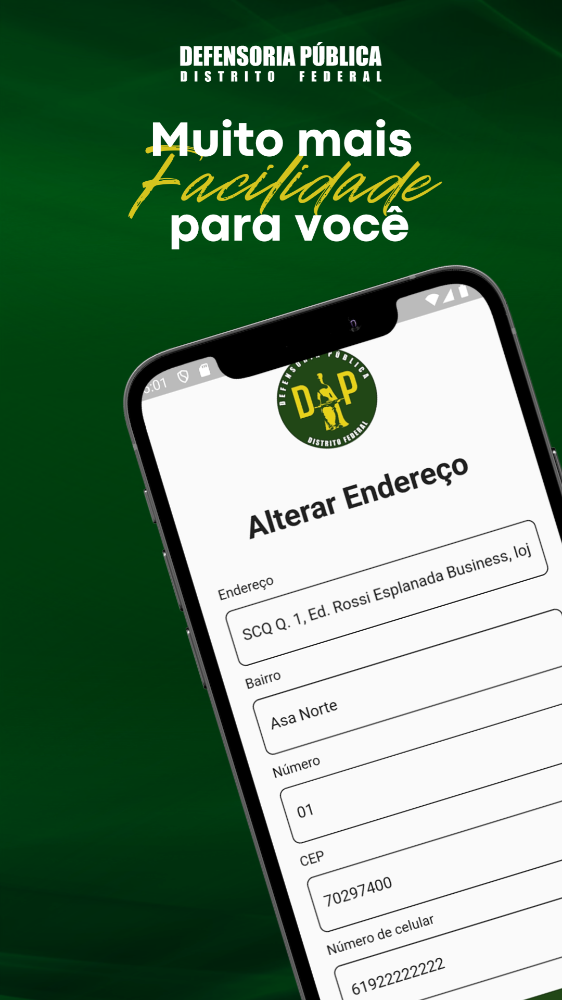
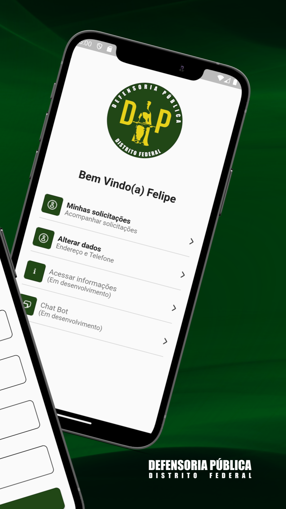
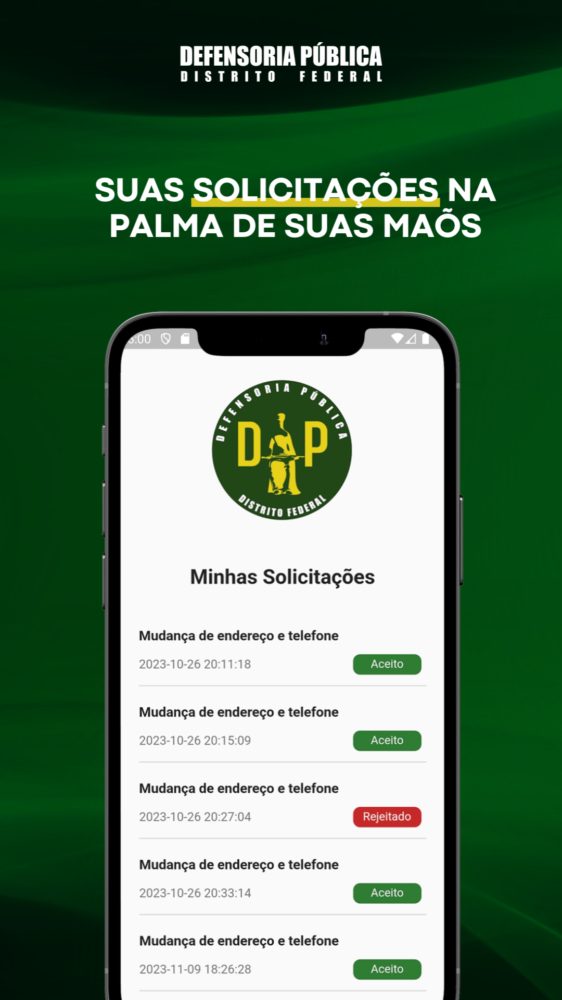
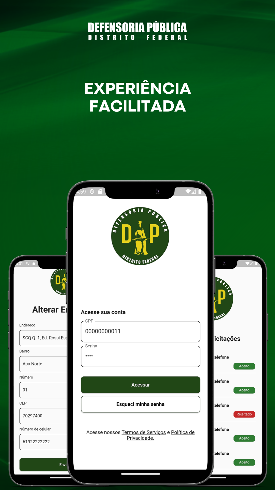

# App da Defensoria Pública do Distrito Federal

 Aplicativo foi desenvolvido para auxiliar a população na atualização de suas informações nos processos judiciais por meio de uma interface amigável e acessível.

|  |  |  |  |
|---|---|---|---|

## Como rodar a aplicação no emulador ou no próprio celular

### 1. Instale o Flutter:
    * Faça o download do Flutter no site oficial.
    * Siga as instruções de instalação para o seu sistema operacional (Windows, macOS ou Linux).

### 2. Instale as dependências:
    * Navegue até o diretório do seu projeto clonado e execute 'flutter pub get' para instalar as dependências do projeto.

### 3. Verifique seu ambiente:
    * Execute 'flutter doctor' para verificar se há problemas no seu ambiente e para instalar quaisquer dependências ausentes.

### 4. Baixar e configurar Android Studio:
    * Baixe android studio no site oficial e configure ele para seu sistema operacional.

### 5. Execute o aplicativo:
    * Selecione o emulador no vscode.
    * No arquivo main.dart clique no play ou em 'run' para executar.

